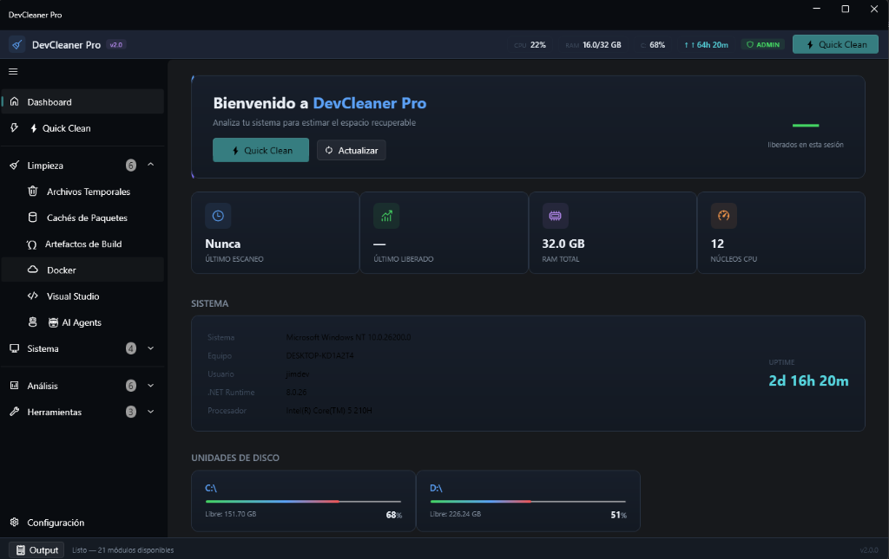

# DevCleaner Pro v2.0 🧹

DevCleaner Pro es una aplicación de escritorio premium y altamente optimizada, diseñada específicamente para desarrolladores y administradores de sistemas en entornos Windows. Construida sobre **.NET 8** y **WPF-UI**, esta herramienta proporciona más de 20 módulos especializados para el análisis profundo, limpieza y optimización del sistema operativo y los entornos de desarrollo, todo en un solo "Command Center".

 *(Nota: reemplaza con captura real)*

## 🚀 Características Principales

DevCleaner Pro está organizado en cuatro categorías fundamentales para abordar todas las necesidades de limpieza y optimización:

### 1. ⚡ Quick Clean
- **One-Click Cleanup**: Ejecuta una limpieza general y segura de forma desatendida.
- Diseñado para no interferir con archivos en uso o procesos de desarrollo activos.

### 2. 🧹 Módulos de Limpieza
- **Archivos Temporales**: Limpieza agresiva de `%TEMP%`, `Prefetch` y caché de Windows Update.
- **Cachés de Paquetes**: Análisis y purga de cachés gigantescos de desarrollo (`npm`, `nuget`, `pip`, `cargo`, `pnpm`, `yarn`).
- **Artefactos de Build (Proyectos)**: Escaneo recursivo para encontrar y eliminar carpetas masivas de compilación (`bin`, `obj`, `node_modules`, `.next`).
- **Docker Cleanup**: Purgado inteligente de contenedores detenidos, imágenes huérfanas y cachés de build (`docker system prune`).
- **Visual Studio**: Limpieza de directorios ocultos `.vs` y ComponentModelCache.
- **AI Agents**: Detección y limpieza de registros, historiales y telemetría de asistentes de IA locales (Cursor, Copilot, Ollama, etc.).

### 3. 🖥️ Optimización de Sistema
- **Optimizar Memoria**: Liberación activa de RAM usando la API nativa de Windows (`EmptyWorkingSet` + `Purge Standby List`).
- **Event Logs**: Vaciado rápido de registros masivos de eventos de Windows (Aplicación, Sistema, Seguridad).
- **DNS Flush**: Restablecimiento del caché de resolución DNS.
- **Portapapeles**: Limpieza del historial del portapapeles por seguridad y privacidad.

### 4. 📊 Análisis e Inspección Avanzada
- **Analizador de Disco**: Auditoría gráfica y listado profundo de archivos masivos que consumen tu almacenamiento.
- **Procesos**: Monitor en tiempo real para visualizar y aniquilar tareas y procesos devoradores de recursos.
- **Programas de Inicio**: Administra qué servicios y aplicaciones arrancan con tu SO.
- **Firewall Audit**: Auditoría rápida de reglas de Firewall del sistema.
- **Registro**: Detecta claves huérfanas del registro de Windows (solo lectura / POC).
- **Shadow Copies**: Gestión de puntos de restauración y copias ocultas del sistema.
- **Herramientas**: Incluye ejecución gráfica de **SFC / DISM** para reparar el sistema, visor de **Historial (Audit Log)** y **Tareas Programadas**.

## 🛠️ Arquitectura y Tecnologías
- **Framework:** .NET 8 (C#)
- **UI Toolkit:** WPF (Windows Presentation Foundation) con la librería [WPF-UI](https://wpfui.lepo.co/) para implementación de Fluent Design.
- **Distribución:** Portable (Self-Contained Single File). No requiere instalación del runtime de .NET.
- **Temas Dinámicos:** Soporte nativo y cambio en tiempo real (Hot-Swap) entre `Dark Mode` (paleta premium refinada) y `Light Mode` (alto contraste).
- **Internacionalización (i18n):** Motor propio (`LanguageManager`) con XAML ResourceDictionaries para cambio de idioma en caliente (ES/EN).

## ⚙️ Compilación y Ejecución (Modo Dev)

Asegúrate de tener instalado el [SDK de .NET 8](https://dotnet.microsoft.com/download/dotnet/8.0).

```bash
# Clonar el repositorio
git clone https://github.com/tu-repo/devcleaner-pro.git
cd devcleaner-pro

# Ejecutar en modo desarrollo
dotnet run --project src/DevCleanerPro/DevCleanerPro.csproj -c Release
```

## 📦 Empaquetado (Producción Portable)

Para generar el ejecutable único (`DevCleanerPro.exe`) que incluye el runtime completo:

```bash
dotnet publish src/DevCleanerPro/DevCleanerPro.csproj -c Release -r win-x64 --self-contained true /p:PublishSingleFile=true /p:IncludeNativeLibrariesForSelfExtract=true
```
El ejecutable resultante estará en:
`src/DevCleanerPro/bin/Release/net8.0-windows/win-x64/publish/DevCleanerPro.exe`

## 👨‍💻 Autor

- Creado por **jimdev** ([jylmdev@gmail.com](mailto:jylmdev@gmail.com))

## 📄 Licencia
Distribuido bajo la Licencia MIT. Ver `LICENSE` para más información.
